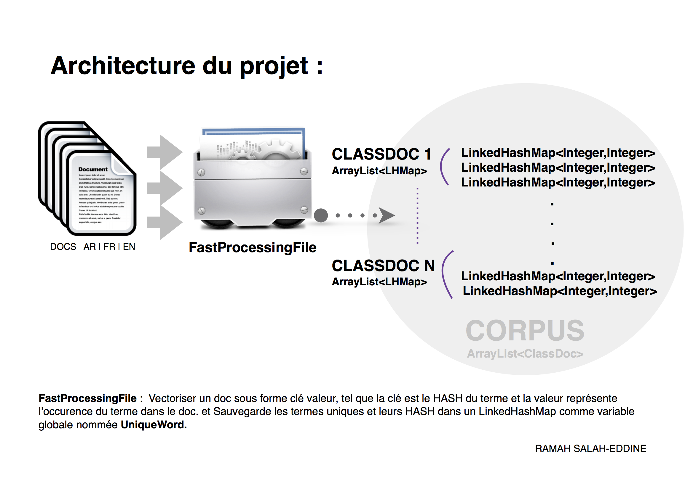

# Text-Mining
Text mining, also referred to as text data mining, roughly equivalent to text analytics, is the process of deriving high-quality information from text. 
High-quality information is typically derived through the devising of patterns and trends through means such as statistical pattern learning.

# About
In this project, I deal with corpuses of different languages such as documents in English, French and Arabic.
I am trying to create homogeneous clusters that combine documents dealing with the same topics using supervised (K-Means, CAH) and unsupervised (NB) techniques. I also added a quick search algorithm to find documents containing a sequence of words based on the BoyerMoore agorithm.

